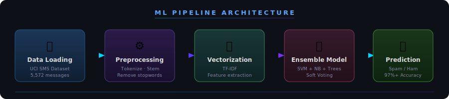
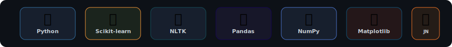

<div align="center">
  <a href="https://github.com/Karan-g-2003/SMS-Spam-Detection">
    
  </a>
</div>

<div align="center">
  
  **Intelligent text classification to separate the signal from the noise.**

  [](#)
  [](#)
  [](#)
  [](#)

</div>


## 🌟 About The Project

In the era of relentless digital marketing and phishing attacks, SMS spam isn't just an annoyance—it's a security risk. This project tackles the problem head-on by leveraging natural language processing (NLP) and machine learning to automatically detect and intercept spam messages with high precision.

Through careful data preprocessing and an ensemble learning approach, this model learns the subtle linguistic patterns that differentiate a friendly text ("ham") from a malicious one ("spam").

### ✨ Key Features

<table>
  <tr>
    <td width="50%">
      <h3 align="center">🧠 Ensemble Learning</h3>
      <p align="center">Combines Support Vector Machines (SVM), Naive Bayes, and Extra Trees Classifiers via soft voting for superior accuracy.</p>
    </td>
    <td width="50%">
      <h3 align="center">📝 Advanced NLP</h3>
      <p align="center">Implements robust text preprocessing, tokenization, stemming, and TF-IDF vectorization to extract meaningful features from raw text.</p>
    </td>
  </tr>
</table>

## 🏗️ Architecture

The pipeline transforms raw SMS text into clean numerical features, which are then evaluated by our ensemble classifier to determine the output.

<div align="center">
  
</div>

## 🛠️ Tech Stack

<div align="center">
  
</div>

## 📊 Performance Metrics

Our custom ensemble model avoids overfitting while maximizing precision to ensure legitimate messages are never accidentally flagged as spam.

<div align="center">
  
</div>

<details>
<summary><b>Click to see detailed model breakdown</b></summary>
<br>

- **Support Vector Machine (SVC)**: Optimized with a sigmoid kernel to capture complex, non-linear text relationships.
- **Multinomial Naive Bayes**: Excellent baseline for text classification based on word frequencies.
- **Extra Trees Classifier**: Provides high-variance feature learning to catch edge-case spam patterns.
- **Voting Classifier**: A 'soft' voting mechanism that averages the predicted probabilities from the above models to make the final decision.

</details>

## 🚀 Quick Start

Want to run this locally? Follow these simple steps:

### Prerequisites

You need Python installed and the ability to run Jupyter Notebooks.

```bash
pip install pandas numpy scikit-learn matplotlib nltk jupyter
```

### Running the Notebook

1. **Clone the repository**
   ```bash
   git clone https://github.com/Karan-g-2003/SMS-Spam-Detection.git
   cd SMS-Spam-Detection
   ```

2. **Open Jupyter Notebook**
   ```bash
   jupyter notebook
   ```

3. **Run `SMS_spamDetection.ipynb`**
   Execute the cells sequentially to watch the data processing, model training, and evaluation in real-time.

## 📁 Repository Structure

```text
📦 SMS-Spam-Detection
 ┣ 📂 assets/                  # High-quality SVG assets for styling
 ┣ 📜 SMS_spamDetection.ipynb  # Main project notebook
 ┗ 📜 README.md                # You are here
```


<div align="center">
  
</div>
